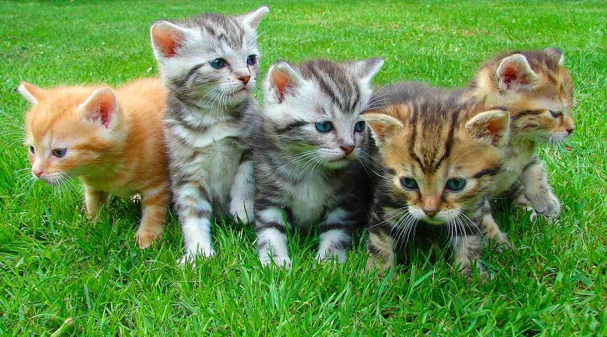

# BTC Puzzle by Corey Phillips hint

This repository contains all publicly known hints for BTC Puzzle by Corey Phillips challenge. Contributions are welcome!

If you find this useful, you can donate BTC at `bc1qezsaphs22e278n235dyw46jyya58352eyk095q`

# Summary
Prize: 0.01 BTC<br>
Creator: Corey Phillips<br>
Start Date: 2019-07-09<br>
Address: bc1qcyrndzgy036f6ax370g8zyvlw86ulawgt0246

# Description
The mnemonic for the kitten photo without a passphrase contains roughly 0.00095133 BTC. Feel free to claim it if you manage to sweep the keys in time.

As a challenge, I have also sent 0.01 BTC to the following address, `bc1qcyrndzgy036f6ax370g8zyvlw86ulawgt0246r`. This address was generated using the kitten image along with a BIP39 passphrase. If you manage to claim it, congrats!




# Solution
Every file can be broken down, defined and represented as a Base64 string. Bitimage extracts the Base64 string from the data URI of any file that you feed it and uses that string to generate a mnemonic phrase.

The Base64 string for the kitten image is rather long so I’ve shortened it for presentation purposes here, `/9j/4AAQSkZJRg …. +MbzXZF3n/2Q==`. Since the Base64 string is rather unwieldy we hash it using the sha256 hash function leaving us with the following, `1808d35318ac7cb98b69ff9779b699d6a631f15e0b353ac89b7c4020774832ed`.

We then pass this hash off to bip39’s `entropyToMnemonic` function to generate our mnemonic phrase. With the mnemonic phrase in hand we can generate our seed with or without a passphrase. Including a passphrase will prevent any random person with access to the file from accessing our funds, assuming the passphrase is sufficient and cannot be easily brute-forced.

Using this seed we can now generate our keyPair and corresponding addresses/private keys for the uploaded file using the bitcoinjs-lib library. As expected, we are left with the following Bitcoin address, `bc1q57euh23y3qs2f9d5mtwpax5lqecfvrdkqce82a`.

# Hints
1. I wrote python script to generate mnemonic phrase from the image.

in the end of `main.py` file set variables filename to image path and passphrase.<br>
Run the script, and you will get public address and private wif key.
```python
if __name__ == "__main__":

    filename = "kitten.jpeg"
    passphrase = ""

    address = get_address_from_file(filename, passphrase)
    print("----------------------------------------------------------")
    print(f"public address: {address[0]}")
    print(f"private wif key: {address[1]}")
    print(f"passphrase: {passphrase}")
```

to install requirements run:
```bash
pip install -r requirements.txt
```

2. Bruteforce

script for bruteforce passphrase: `bruteforce.py`

put `*.txt` files into folder `wordlists` and run the script.

if you find the passphrase, you can get message `Passphrase found`.

I've tried to brute-force each file from the site https://wiki.skullsecurity.org/index.php/Passwords and got nothing.

Maybe you'll have better luck

3. Steganography was embedded in the original image. Here are some websites that can help with this
- https://book.hacktricks.xyz/crypto-and-stego/stego-tricks
- https://www.aperisolve.com/
- https://stylesuxx.github.io/steganography/
- https://georgeom.net/StegOnline/upload